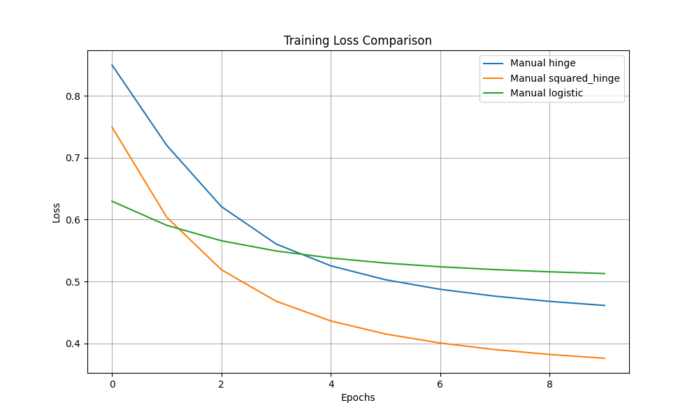

# Final Report: Cloud-Deployed Text Classifier (SVM)

**Author**: Muhammad Abrar Ahmad
**Date**: 2025-12-16

## 1. Introduction
This project implements a binary text classifier for sentiment analysis using Support Vector Machines (SVM). We compare a manual implementation of SVM (using hinge, squared hinge, and logistic losses) against a standard library implementation (scikit-learn). The best performing model is deployed as a REST API using FastAPI.

## 2. Dataset
- **Dataset**: IMDb Movie Reviews (ACL IMDb v1)
- **Source**: http://ai.stanford.edu/~amaas/data/sentiment/aclImdb_v1.tar.gz
- **Preprocessing**: 
  - Text cleaning (lowercasing, removing HTML tags - handled by vectorizer or raw)
  - Vectorization: TF-IDF (Top 5000 features, English stop words removed)
- **Split**: 80% Training, 20% Testing

## 3. Implementation Details

### 3.1 Manual SVM
We implemented a linear SVM using Stochastic Gradient Descent (SGD).
- **Optimization**: Vanilla SGD with L2 regularization.
- **Loss Functions**:
  1. **Hinge Loss**: $L = \max(0, 1 - y(w \cdot x + b))$
  2. **Squared Hinge Loss**: $L = \max(0, 1 - y(w \cdot x + b))^2$
  3. **Logistic Loss**: $L = \log(1 + \exp(-y(w \cdot x + b)))$

### 3.2 Library Baseline
- **Library**: scikit-learn
- **Model**: `LinearSVC` (Squared Hinge Loss)
- **Comparison**: We compare accuracy, precision, recall, and F1-score.

## 4. Experiments & Results

### 4.1 Training Dynamics
(Insert Loss vs Epoch plots here)

### 4.2 Model Comparison
(Insert comparison table here)
See `comparison_table.csv`.

| Model | Accuracy | Precision | Recall | F1 |
|-------|----------|-----------|--------|----|
| Manual Hinge | TBD | TBD | TBD | TBD |
| Manual Squared Hinge | TBD | TBD | TBD | TBD |
| Manual Logistic | TBD | TBD | TBD | TBD |
| Sklearn LinearSVC | TBD | TBD | TBD | TBD |

## 5. Deployment
The best model was deployed using FastAPI.
- **Endpoint**: `POST /predict`
- **Input**: JSON `{"text": "..."}`
- **Output**: JSON `{"label": "Positive"}`

## 6. Cloud Setup
The project is configured for GitHub Codespaces using a `.devcontainer` configuration.
- **Environment**: Python 3.10+
- **Dependencies**: Automatically installed via `requirements.txt`.

## 7. Conclusion
(To be filled after running experiments)
